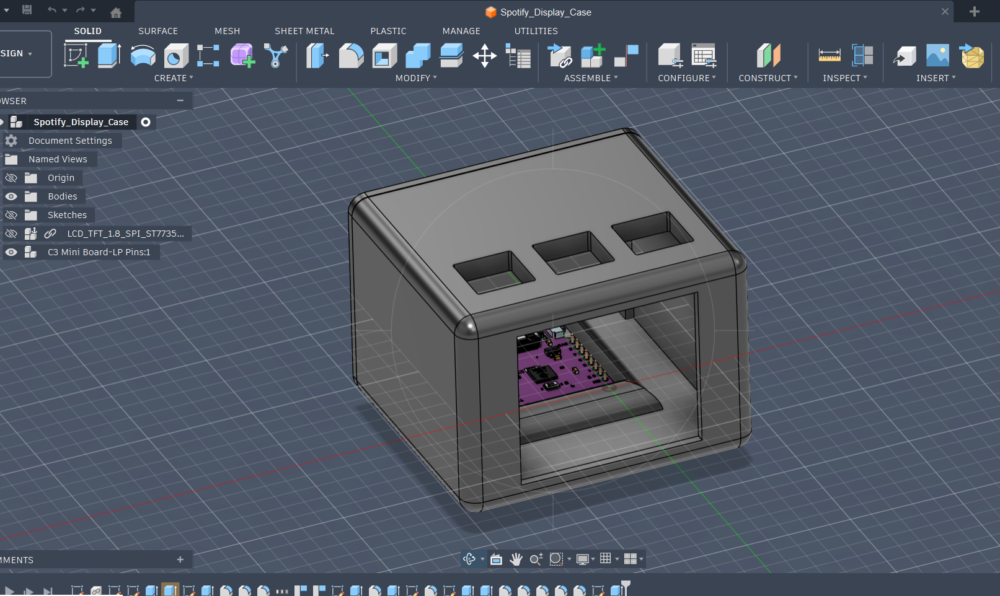

# Spotify Display
Using an ESP32 and Spotify's library to display songs playing. 

### Inspiration

I wanted to create a cool, small project involving music.

### Challenges

This is my second time using Fusion 360, and it's quite challenging for me to get the hand of it.

### Specifications

ESP 32
3D printed case
1.8" TFT Display

   Case
:-------------------------:|

